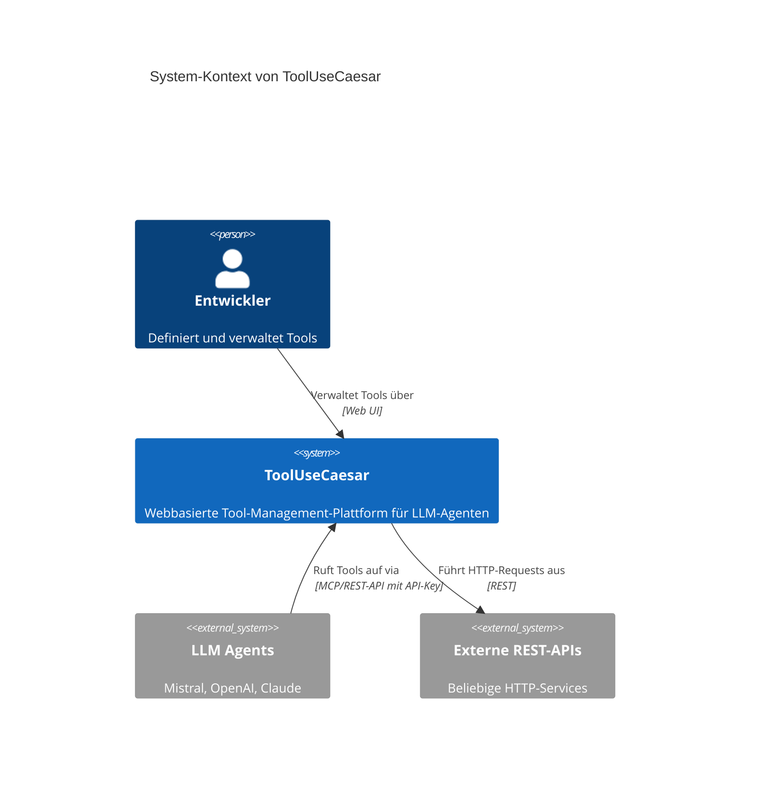

# 1. Einführung und Ziele

Dieses Kapitel beschreibt die wesentlichen Anforderungen und treibenden Kräfte von ToolUseCaesar, die bei der Umsetzung der Softwarearchitektur berücksichtigt wurden.

## 1.1 Aufgabenstellung

ToolUseCaesar ist eine webbasierte Plattform zur Definition, Verwaltung und Bereitstellung von Tools für KI-Agenten und Large Language Models (LLMs). Die Anwendung ermöglicht es Entwicklern, Werkzeuge zu definieren und diese über standardisierte Schnittstellen (MCP oder REST-API) an LLM-Agenten wie Mistral, OpenAI oder Claude (Anthropic) bereitzustellen.

### Kernfunktionalität

Die Anwendung erlaubt die Definition von Tools mit folgenden Merkmalen:

- **REST-API Integration**: Aufruf externer REST-APIs mit konfigurierbaren Parametern (Endpoint, Methode, Headers, Body)
- **Datenverarbeitung**: Vor- und Nachbereitung von Daten durch JavaScript-Code (Pre-/Post-Processing)
- **Tool-Verkettung**: Verknüpfung mehrerer Tools zu komplexen Workflows (Chains) mit Output-zu-Input-Mapping
- **Berechnungsschritte**: Ausführung reiner JavaScript-Berechnungen ohne HTTP-Calls
- **Schnelles Prototyping**: Verwendung von Fake Responses für Tests ohne externe API-Aufrufe

Die Tools werden im Mistral-kompatiblen Function-Call-Format bereitgestellt und können von LLM-Agenten direkt verwendet werden.

### Technischer Kontext

### Abgrenzung

ToolUseCaesar ist **kein**:
- LLM-Provider oder KI-Modell
- Hosting-Service für externe APIs
- Komplexe Workflow-Engine mit Bedingungslogik
- Öffentlich zugänglicher Service (erfordert Authentifizierung)

## 1.2 Qualitätsziele

Die folgende Tabelle zeigt die wichtigsten Qualitätsziele für ToolUseCaesar, geordnet nach Priorität:

| Priorität | Qualitätsziel | Motivation | Erfüllungsszenario |
|-----------|---------------|------------|-------------------|
| 1 | **Funktionalität** | Die Kernfunktionen (Tool-Definition, Ausführung, MCP-Bereitstellung) müssen zuverlässig arbeiten | Ein Entwickler kann ein Tool definieren, testen und es erfolgreich von einem LLM-Agenten aufrufen lassen |
| 2 | **Sicherheit** | Unbefugter Zugriff muss verhindert werden | Alle MCP-Endpunkte sind nur mit gültigem API-Key erreichbar; Session-basierte Authentifizierung schützt die Web-Oberfläche |
| 3 | **Nachvollziehbarkeit** | Nutzer müssen verstehen, wie Tools aufgerufen und ausgeführt werden | Die Oberfläche zeigt API-Key, Endpoint-URLs und Ausführungshistorie transparent an; Logs dokumentieren jeden Tool-Aufruf |
| 4 | **Benutzerfreundlichkeit** | Schnelle Definition und Test von Tools ohne lokale Installation | Entwickler können innerhalb von Minuten ein funktionsfähiges Tool erstellen und mit einem LLM verknüpfen |
| 5 | **Wartbarkeit** | Code-Struktur soll verständlich und erweiterbar sein | Klare Trennung Frontend/Backend, typsichere Schemas, modulare Architektur (siehe [shared/schema.ts](/shared/schema.ts)) |

## 1.3 Stakeholder

Die folgende Tabelle zeigt die wichtigsten Stakeholder und ihre Erwartungen an das System:

| Rolle | Beschreibung | Erwartungshaltung |
|-------|-------------|-------------------|
| **Entwickler** | Nutzer, die Tools für LLM-Agenten definieren und verwalten | - Intuitive Web-Oberfläche für Tool-Definition - Schnelles Testen und Debugging von Tools - Klare API-Dokumentation - Sichere Authentifizierung |
| **LLM-Agenten** | KI-Systeme, die definierte Tools aufrufen | - Standardisiertes Mistral-Format für Tool-Definitionen - Zuverlässige Ausführung - Klare Fehlerbehandlung - Niedrige Latenz |
| **Administrator** | Verantwortlich für Betrieb und Nutzerverwaltung | - Einfache Installation und Konfiguration - Nutzerverwaltung über Web-Oberfläche - API-Key-Verwaltung - Monitoring von Ausführungen |
| **Architekt/Entwickler (dieses Systems)** | Pflegt und erweitert ToolUseCaesar | - Klare Architektur-Dokumentation (arc42) - Wartbarer, verständlicher Code - Typsicherheit durch TypeScript/Zod - Modulare Struktur für Erweiterungen |

## 1.4 Weitere Informationen

- **Projekt-Repository**: [GitHub - ToolUseCaesar](https://github.com/merlinbecker/ToolUseCaesar)
- **Technische Implementierung**: Siehe Kapitel 5 (Bausteinsicht) und Kapitel 8 (Konzepte)
- **API-Referenz**: Siehe [replit.md](/replit.md) für API-Endpoints
- **Design-Richtlinien**: Siehe [design_guidelines.md](/design_guidelines.md)
